# Auto PR Merge Workflow

This workflow automatically merges a Pull Request after verifying that all required status checks have passed and the PR has been approved by a code owner.

## Workflow Flowchart

```mermaid
flowchart TD
    A([🚀 Workflow Triggered]) --> B[Step 1: Check PR Status Before Merge]

    B --> B1[Call GitHub API\nGET /repos/.../pulls/PR_NUMBER]
    B1 --> B2{mergeable == null?}
    B2 -- Yes --> B3{Retries < 5?}
    B3 -- Yes --> B4[Sleep 3s & Retry]
    B4 --> B1
    B3 -- No --> B5[Proceed with last response]
    B2 -- No --> B5
    B5 --> B6{PR state == open?}
    B6 -- No --> SKIP([⏹️ Skip — PR Not Open])
    B6 -- Yes --> C

    C[Step 2: Check All Required Status Checks] --> C1[Get PR HEAD SHA & Base Branch\nGET /repos/.../pulls/PR_NUMBER]
    C1 --> C2[Get All Check Runs for Commit\nGET /repos/.../commits/SHA/check-runs]
    C2 --> C3[Get Required Checks from Branch Protection\nGET /repos/.../branches/BRANCH/protection/required_status_checks]
    C3 --> C4{Required checks\nfound?}

    C4 -- Yes --> D1[Validate Only Required Checks]
    C4 -- No --> D2[Validate ALL Check Runs]

    D1 --> E
    D2 --> E

    E{For Each Check Run} --> E1{Is it\nAuto Merge?}
    E1 -- Yes --> E5[⏭️ Skip Self]
    E5 --> E
    E1 -- No --> E2{status ==\ncompleted?}
    E2 -- No --> E6[Mark as ⏳ Pending]
    E6 --> E
    E2 -- Yes --> E3{conclusion ==\nsuccess or skipped?}
    E3 -- Yes --> E4[Mark as ✅ Passed]
    E3 -- No --> E7[Mark as ❌ Failed]
    E4 --> E
    E7 --> E

    E --> F[Check Review Approval\nGET /repos/.../pulls/PR_NUMBER/reviews]
    F --> G{Any APPROVED\nreviews?}

    G -- No --> NOREV([❌ Not Ready — No Approval])
    G -- Yes --> H{Any Failed\nchecks?}
    H -- Yes --> FAIL([❌ Not Ready — Checks Failed])
    H -- No --> I{Any Pending\nchecks?}
    I -- Yes --> PEND([⏳ Not Ready — Checks Pending])
    I -- No --> J

    J[Step 3: Merge PR] --> J1[Call GitHub API\nPUT /repos/.../pulls/PR_NUMBER/merge\nmethod: squash]
    J1 --> J2{HTTP 200?}
    J2 -- Yes --> SUCCESS([✅ PR Merged Successfully!])
    J2 -- No --> MERR([❌ Merge Failed])

    style A fill:#4CAF50,color:#fff
    style SUCCESS fill:#4CAF50,color:#fff
    style SKIP fill:#9E9E9E,color:#fff
    style FAIL fill:#F44336,color:#fff
    style NOREV fill:#F44336,color:#fff
    style PEND fill:#FF9800,color:#fff
    style MERR fill:#F44336,color:#fff
```

## Workflow Steps Detail

### Step 1 — Check PR Status Before Merge

Calls the GitHub Pulls API with retry logic (up to 5 attempts, 3s delay) to wait for GitHub to compute the `mergeable` field. If the PR is not in an `open` state, the workflow exits early.

**API Endpoint:** `GET /repos/{owner}/{repo}/pulls/{pr_number}`

**Key fields checked:** `state`, `mergeable`, `mergeable_state`

-----

### Step 2 — Check All Required Status Checks

This is the core validation step, which calls three API endpoints:

|#|API Endpoint                                                                   |Purpose                          |
|-|-------------------------------------------------------------------------------|---------------------------------|
|1|`GET /repos/{owner}/{repo}/pulls/{pr_number}`                                  |Get HEAD SHA and base branch     |
|2|`GET /repos/{owner}/{repo}/commits/{sha}/check-runs`                           |Get all check runs for the commit|
|3|`GET /repos/{owner}/{repo}/branches/{branch}/protection/required_status_checks`|Get list of required checks      |
|4|`GET /repos/{owner}/{repo}/pulls/{pr_number}/reviews`                          |Check for approved reviews       |

**Validation logic:**

- If required checks are defined in branch protection, only those checks are validated
- If branch protection rules are unavailable, all check runs are validated as a fallback
- The workflow’s own check run (matching `auto.merge`) is always skipped to avoid circular dependency
- Each check is categorized as **Passed** (`success` / `skipped`), **Pending** (not `completed`), or **Failed** (any other conclusion)
- The PR must have at least one `APPROVED` review

**Decision matrix:**

|Failed|Pending|Approved|Result          |
|------|-------|--------|----------------|
|Yes   |—      |—       |❌ Not ready     |
|No    |Yes    |—       |⏳ Not ready     |
|No    |No     |No      |❌ Not ready     |
|No    |No     |Yes     |✅ Ready to merge|

-----

### Step 3 — Merge PR

Executes the merge via the GitHub API using the `squash` merge method.

**API Endpoint:** `PUT /repos/{owner}/{repo}/pulls/{pr_number}/merge`

**Request body:** `{"merge_method": "squash"}`

-----

## Required Permissions

|Permission         |Scope                |Purpose                                                               |
|-------------------|---------------------|----------------------------------------------------------------------|
|`TDUNPIDPAT` Secret|`repo`, `checks:read`|API authentication for reading PR status, checks, and performing merge|